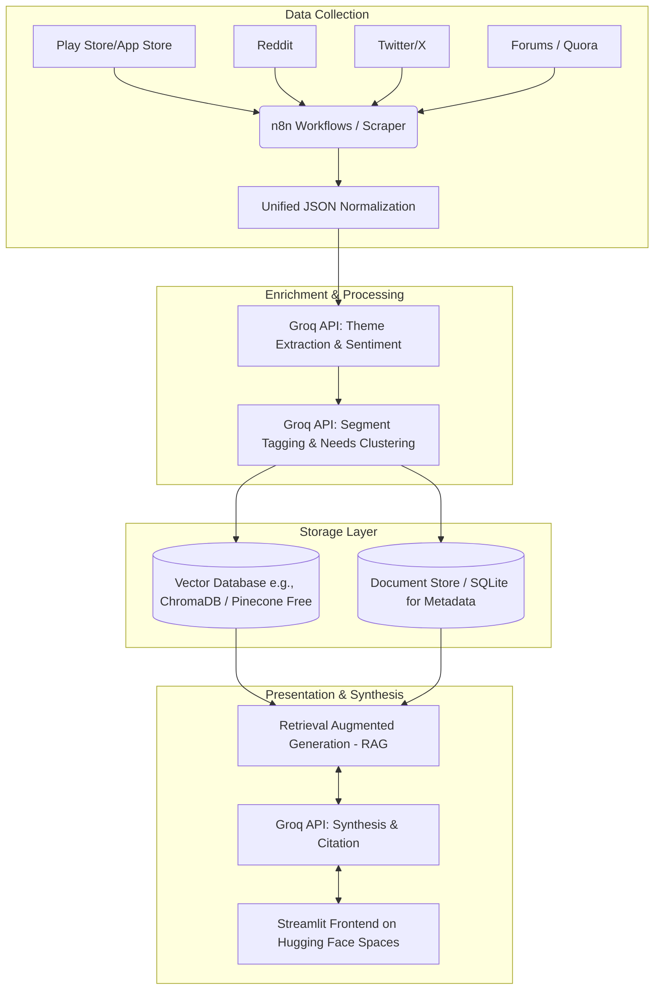

# Architecture Design: AI-Powered Discovery Engine

This document details the architecture for the Blinkit AI-Powered Discovery Engine, based on the requirements outlined in the [Problem Statement](problemStatement.md). 

> **Important Constraint**: The entire architecture is designed to be built using **100% free-of-cost tools and services**.

---

## 1. High-Level Architecture Overview

The system is designed as a pipeline with four distinct layers:
1. **Data Collection & Ingestion Layer**: Scrapes and normalizes unstructured feedback.
2. **Enrichment & Processing Layer**: Uses the Groq API for rapid LLM-based tagging and extraction.
3. **Storage & Retrieval Layer**: A vector database for semantic search and RAG capabilities.
4. **Presentation (Frontend) Layer**: A Streamlit application for users to interact with the insights.



---

## 2. Component Breakdown

### 2.1. Data Collection & Ingestion Layer
* **Tools**: n8n (Free/Community Edition) or custom Python Scraper Agents (using BeautifulSoup/Scrapy).
* **Function**: Periodically pulls unstructured data from target sources:
  - App reviews (Blinkit, Instamart, Zepto).
  - Social media & forums (Reddit, X, Quora).
* **Normalization**: All incoming data is normalized into a standard JSON schema before processing.
  ```json
  {
    "source": "Reddit - r/bangalore",
    "text": "User review or comment text here...",
    "rating": null,
    "timestamp": "2023-10-01T12:00:00Z",
    "product": "Blinkit"
  }
  ```

### 2.2. Enrichment & Processing Layer
* **Tools**: Groq API (Free Tier).
* **Function**: Passes the normalized text through prompts designed to extract structured metadata.
  - **Theme Extraction**: Identifying recurring reasons for shopping behavior (e.g., "Trust issues with fresh produce").
  - **Sentiment Tagging**: Categorizing as Positive, Neutral, or Negative.
  - **Segment Inference**: Identifying user personas (e.g., "Pet Owner", "New Parent").
  - **Unmet-Need Clustering**: Highlighting gaps in current offerings.

### 2.3. Storage Layer
* **Tools**: 
  - **Vector Database**: ChromaDB (Open-source/Free) or Pinecone (Free Tier) to store text embeddings for semantic search.
  - **Embedding Model**: Hugging Face free inference API or local lightweight sentence-transformers (e.g., `all-MiniLM-L6-v2`) to generate embeddings at zero cost.
  - **Document DB**: A simple SQLite database or JSON store to keep the raw text mapped to the vector IDs for retrieval and citation.

### 2.4. Retrieval & Synthesis (RAG) Layer
* **Tools**: Groq API + LangChain/LlamaIndex (Open-source).
* **Function**: 
  - Takes user queries from the frontend.
  - Retrieves top-k most relevant reviews from the Vector DB based on semantic similarity.
  - Sends the retrieved context and user query to Groq API to generate an answer.
  - **Constraint**: Strict citation requirements. The LLM must cite the source snippets it used to generate the answer to prevent hallucinations.

### 2.5. Frontend & Presentation Layer
* **Tools**: Python + Streamlit, deployed on Hugging Face Spaces (Free Hosting).
* **Function**: An interactive dashboard to showcase findings.
  - **Timeline Filters**: Slider to view trends over specific months.
  - **Distributions**: Charts showing sentiment and source breakdowns.
  - **Theme Taxonomy**: Clickable themes that reveal underlying raw reviews.
  - **Chatbot Interface**: A RAG-powered chatbot with pre-populated prompt chips allowing reviewers to query the review corpus dynamically.

---

## 3. Validation & Quality Assurance (Human-in-the-Loop)
To ensure the engine is actionable and accurate (as per the success criteria):
* **Traceability Checks**: Every generated insight in the Streamlit app links directly back to the raw source text.
* **Spot Checks**: Periodic manual sampling to verify that the themes Groq extracts match human interpretation.
* **RAG Constraints**: System prompts force the LLM to reply "I don't know based on the data provided" if the Vector DB returns no relevant context.

---

## 4. Security & Data Privacy
- **Anonymization**: PII (Personally Identifiable Information) like usernames or emails should be stripped during the Data Collection / Normalization phase before being sent to the Groq API.
- **Cost Controls**: Since the requirement is strictly free-of-cost, rate limits on the Groq API and Hugging Face spaces will be monitored to ensure the system operates within free-tier boundaries.
