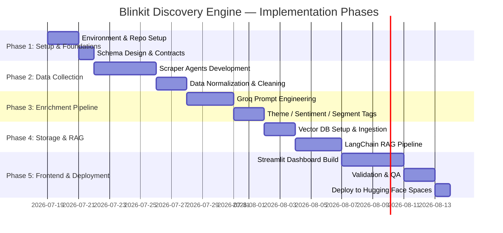

# Implementation Plan: Blinkit AI-Powered Discovery Engine (Part 1)

> **References**: [Problem Statement](problemStatement.md) | [Architecture](architecture.md)
>
> **Constraint**: All tools and services used are **100% free of cost**.
> **LLM**: Groq API (Free Tier)

---

## Overview

The plan is divided into **5 phases**, each building on the previous, culminating in a deployed, interactive Streamlit demo.



---

## Phase 1: Project Setup & Foundations

### Goals
- Establish the project structure, tool stack, and shared data contracts.
- Ensure all free tools are configured and working before any data is collected.

### Steps

#### 1.1 Environment & Repository Setup
- Initialize a Git repository: `Blinkit-Discovery-Engine/`
- Create a virtual environment (`venv`) with `requirements.txt`
- Key initial dependencies:
  ```
  groq
  chromadb
  sentence-transformers
  langchain
  langchain-groq
  streamlit
  praw           # Reddit API
  requests
  beautifulsoup4
  pandas
  python-dotenv
  ```
- Set up `.env` file for API keys (Groq API key, Reddit API credentials)
- Add a `.env.example` for documentation

#### 1.2 Project Directory Structure
```
Blinkit-Discovery-Engine/
├── docs/
│   ├── problemStatement.md
│   ├── architecture.md
│   └── implementation-plan.md
├── data/
│   ├── raw/            # Raw scraped data (JSON per source)
│   └── processed/      # Normalized + enriched data
├── src/
│   ├── collectors/     # Source-specific scrapers
│   ├── enrichment/     # Groq-based enrichment pipeline
│   ├── storage/        # ChromaDB + SQLite handlers
│   ├── rag/            # LangChain RAG chain
│   └── utils/          # Shared helpers (logging, schema, PII strip)
├── app/
│   └── streamlit_app.py
├── notebooks/          # Exploratory analysis / prompt testing
├── .env.example
├── requirements.txt
└── README.md
```

#### 1.3 Data Schema Design
Define and lock the **Unified Review JSON Schema** used across all pipeline stages:
```json
{
  "id": "uuid-v4",
  "source": "Reddit | Play Store | App Store | Twitter | Forum",
  "platform": "Blinkit | Instamart | Zepto",
  "text": "Raw review text (PII stripped)",
  "rating": 4,
  "timestamp": "2023-10-01T12:00:00Z",
  "url": "https://...",
  "enrichment": {
    "themes": ["Trust - Fresh Produce", "Habit Loop - Reordering"],
    "sentiment": "Negative",
    "segment": ["Pet Owner", "Grocery Buyer"],
    "unmet_needs": ["Better category discovery", "Return policy clarity"]
  }
}
```

### Deliverables
- [ ] Initialized repo with directory structure
- [ ] `requirements.txt` and `.env.example`
- [ ] Finalized JSON schema documented in `docs/`

---

## Phase 2: Data Collection & Normalization

### Goals
- Build scraper/collector agents for each data source.
- Normalize all data into the unified JSON schema.
- Apply PII stripping before downstream processing.

### Steps

#### 2.1 Source Collectors

| Source | Tool / Method | Free? |
|---|---|---|
| Reddit | PRAW (Python Reddit API Wrapper) | ✅ Free |
| Play Store Reviews | `google-play-scraper` library | ✅ Free |
| App Store Reviews | `app-store-scraper` library | ✅ Free |
| Twitter/X | Apify free tier or Nitter RSS scraping | ✅ Free |
| Quora / Forums | BeautifulSoup + requests scraping | ✅ Free |

Each collector lives in `src/collectors/<source>_collector.py` and:
1. Fetches data from the source.
2. Outputs raw data to `data/raw/<source>_raw.json`.

#### 2.2 Normalization & Cleaning (`src/utils/normalizer.py`)
- Parse each raw source format into the **Unified JSON Schema**.
- Strip PII: remove usernames, emails, phone numbers (regex-based).
- Deduplicate reviews by content hash.
- Filter to **English language** only (using `langdetect`).
- Output to `data/processed/normalized.json`.

#### 2.3 Sampling Strategy
- Target **~50–100 reviews per source** per app (Blinkit, Instamart, Zepto) to stay comfortably within Groq free-tier rate limits during the enrichment phase.
- Date filter: Last **6 months** as primary window.
- Store timestamp metadata to support timeline filtering in the frontend.
- Enrichment is performed via **batched Groq calls** (batch size: 10 reviews at a time) with **exponential backoff** on `429 Too Many Requests` errors to avoid hitting rate limits.

### Deliverables
- [ ] `src/collectors/` — one file per source
- [ ] `src/utils/normalizer.py` — cleaning, deduplication, PII strip
- [ ] `data/processed/normalized.json` — ready for enrichment
- [ ] `notebooks/01_data_exploration.ipynb` — EDA on collected data

---

## Phase 3: Enrichment Pipeline (Groq API)

### Goals
- Use the Groq API to enrich each normalized review with themes, sentiment, segment tags, and unmet needs.
- Operate within Groq's free-tier rate limits.

### Steps

#### 3.1 Groq API Setup
- Use **`llama3-8b-8192`** or **`gemma2-9b-it`** on the Groq free tier (fast inference, generous free limits).
- Authenticate via `GROQ_API_KEY` from `.env`.

#### 3.2 Prompt Engineering (`src/enrichment/prompts.py`)

Design structured prompts that return **JSON output** for each review:

```
System: You are an expert UX researcher analyzing user reviews of quick-commerce apps.

User: Analyze the following review and return a JSON object with these exact keys:
- "themes": list of 1-3 short theme labels (e.g., "Habit Loop", "Category Trust", "Stockout Frustration")
- "sentiment": one of "Positive", "Neutral", "Negative"
- "segment": list of user segments inferred FREELY from the review text itself (e.g., "Pet Owner", "New Parent", "Health-Conscious", "Budget Shopper"). Do NOT use a fixed list — derive segment labels organically based on what the reviewer says about themselves or their household context. Return an empty list if no segment can be inferred.
- "unmet_needs": list of 0-2 explicit gaps or requests mentioned (empty list if none)

Review: "{review_text}"

Return ONLY valid JSON. No explanation.
```

> **Note on Segment Discovery**: Segments are **not predefined**. The LLM infers them from signals in the review text (e.g., mentions of pets, babies, diet, festive shopping, solo living). After enrichment, a post-processing step will cluster and canonicalize the raw inferred segment labels across the full corpus to create a final taxonomy.

#### 3.3 Batch Enrichment Runner (`src/enrichment/enrichment_runner.py`)
- Processes reviews in **batches of 10** with configurable delay between batches.
- Implements **exponential backoff** on HTTP `429` errors: starts at 5s, doubles on each retry (max 3 retries per review).
- Skips and logs permanently failed reviews for manual inspection.
- Appends the `enrichment` object to each review record incrementally (checkpoint saves every 50 records to avoid data loss on crash).
- Saves final enriched data to `data/processed/enriched.json`.

#### 3.4 Answering the 8 Research Questions
After enrichment, run a **dedicated synthesis prompt** against the full enriched dataset, one prompt per research question:

| Research Question | Prompt Strategy |
|---|---|
| Why do users repeatedly buy the same categories? | Aggregate "Habit Loop" themes, ask Groq to summarize with evidence |
| What prevents exploration of new categories? | Filter negative sentiments + "Category Discovery" themes |
| How do users discover new products? | Search for "Discovery Method" theme clusters |
| What role do habit and routine play? | Aggregate "Fixed Weekly List" and "Routine" themes |
| What trust signals are needed? | Aggregate "Category Trust" and "Quality Concern" themes |
| What frustrations recur? | Top negative themes by frequency |
| Which segments show higher exploration? | Cross-reference segment tags with "Exploration" themes |
| What unmet needs come up? | Aggregate `unmet_needs` field across all reviews |

### Deliverables
- [ ] `src/enrichment/prompts.py`
- [ ] `src/enrichment/enrichment_runner.py`
- [ ] `data/processed/enriched.json`
- [ ] `notebooks/02_prompt_testing.ipynb` — validate prompt quality manually
- [ ] Research question synthesis outputs (JSON or MD)

---

## Phase 4: Storage & RAG Pipeline

### Goals
- Ingest enriched data into a vector store for semantic search.
- Build a LangChain RAG chain that answers free-text queries grounded in the collected corpus.

### Steps

#### 4.1 Vector Database Setup (`src/storage/vector_store.py`)
- **Tool**: ChromaDB (local, no server required, 100% free).
- Generate embeddings using `sentence-transformers` model `all-MiniLM-L6-v2` (runs locally, no API cost).
- Index each review's `text` field with its `enrichment` metadata as ChromaDB metadata for filtering.
- Persist the ChromaDB collection to disk (`data/chroma_db/`).

```python
# Example ingestion
collection.add(
    ids=[review["id"]],
    embeddings=[embedding],
    documents=[review["text"]],
    metadatas=[{
        "source": review["source"],
        "platform": review["platform"],
        "sentiment": review["enrichment"]["sentiment"],
        "themes": ", ".join(review["enrichment"]["themes"]),
        "timestamp": review["timestamp"]
    }]
)
```

#### 4.2 SQLite Metadata Store (`src/storage/metadata_store.py`)
- Store full enriched review records in SQLite for structured queries.
- Enable filtered retrieval for the Streamlit dashboard (e.g., "show reviews from last 3 months").
- Schema: `reviews(id, source, platform, text, rating, timestamp, themes, sentiment, segment, unmet_needs)`

#### 4.3 LangChain RAG Chain (`src/rag/rag_chain.py`)
- **Retriever**: ChromaDB as a LangChain vector store retriever (top-k = 5).
- **LLM**: Groq API via `langchain-groq` integration.
- **System Prompt**: Forces the model to answer strictly from retrieved context and cite the source IDs.
  ```
  You are a research assistant analyzing Blinkit user reviews.
  Answer the user's question based ONLY on the provided review excerpts.
  For every claim, cite the review source (e.g., [Reddit, Blinkit, 2023-09]).
  If the context doesn't contain enough information, say: "The available data doesn't cover this."
  ```
- **Output**: Structured answer with inline citations.

### Deliverables
- [ ] `src/storage/vector_store.py` — ChromaDB ingestion + query interface
- [ ] `src/storage/metadata_store.py` — SQLite CRUD helpers
- [ ] `src/rag/rag_chain.py` — LangChain RAG pipeline
- [ ] `data/chroma_db/` — persisted vector index
- [ ] `notebooks/03_rag_testing.ipynb` — test RAG chain against 8 research questions

---

## Phase 5: Frontend, Validation & Deployment

### Goals
- Build the interactive Streamlit demo covering all 6 frontend sections.
- Run validation to confirm engine reliability.
- Deploy to Hugging Face Spaces.

### Steps

#### 5.1 Streamlit App (`app/streamlit_app.py`)

Six sections, as specified in the Problem Statement:

| Section | Implementation |
|---|---|
| **a) Timeline-filtered reviews** | `st.slider` for date range; SQLite query to filter by `timestamp`; display top reviews sorted by theme frequency |
| **b) Distribution of reviews** | Plotly/Altair pie charts (source split, sentiment split, category-mention split) — rendered client-side, free |
| **c) Theme taxonomy panel** | Expandable table of themes with frequency %, trend direction vs. prior period; click to reveal raw review snippets from SQLite |
| **d) Segment breakdown** | Bar chart of themes per segment; toggleable by user persona |
| **e) Chatbot preview** | Pre-written question chips as `st.button`; free-text `st.chat_input`; calls RAG chain; displays answer + citations |
| **f) Unmet needs** | Aggregated `unmet_needs` from enriched data as a ranked list with review counts |

#### 5.2 Validation & QA

**Automated checks:**
- **Traceability test**: Randomly sample 20 Groq-generated themes and verify each maps to at least one real review in the corpus.
- **RAG grounding test**: Ask each of the 8 research questions; confirm answers include citations.

**Manual spot-check protocol:**
1. Randomly select 50 reviews from `enriched.json`.
2. Manually assess:
   - Are the assigned themes accurate?
   - Is the sentiment label correct?
   - Is the segment inference reasonable?
3. Calculate a simple **precision score** per category.
4. Document results in `docs/validation-report.md`.

**Success Criteria (from Problem Statement):**
- [ ] All themes traceable to source quotes.
- [ ] No fabricated themes present in manual sample.
- [ ] Segment clusters are directionally consistent.
- [ ] Insights are specific, not generic.
- [ ] Chatbot stays grounded (no unsupported claims).

#### 5.3 Deployment to Hugging Face Spaces (Free)
1. Create a Hugging Face account and new Space (Streamlit SDK).
2. Push repository to the Hugging Face Space Git remote.
3. Add `GROQ_API_KEY` as a **Secret** in the Space settings (never hardcoded).
4. The `data/chroma_db/` and `data/processed/enriched.json` are committed to the repo and loaded at startup.

### Deliverables
- [ ] `app/streamlit_app.py` — fully functional dashboard
- [ ] `docs/validation-report.md` — spot-check results
- [ ] Deployed Hugging Face Space with shareable public URL
- [ ] Updated `README.md` with usage instructions and Space link

---

## Summary: Deliverables Checklist

| Phase | Key Output | Status |
|---|---|---|
| Phase 1 | Repo + schema + project structure | `[ ]` |
| Phase 2 | Normalized data ready | `[ ]` |
| Phase 3 | Groq enrichment + research Q synthesis | `[ ]` |
| Phase 4 | ChromaDB index + RAG chain | `[ ]` |
| Phase 5 | Deployed Streamlit demo + validation report | `[ ]` |

---

## Tech Stack Summary (All Free)

| Component | Tool | Cost |
|---|---|---|
| LLM | Groq API (llama3-8b or gemma2) | ✅ Free tier |
| Embeddings | `sentence-transformers` (local) | ✅ Free |
| Vector DB | ChromaDB (local) | ✅ Free |
| Metadata DB | SQLite | ✅ Free |
| RAG Framework | LangChain + langchain-groq | ✅ Open source |
| Reddit Scraper | PRAW | ✅ Free |
| App Store Scraper | `google-play-scraper` / `app-store-scraper` | ✅ Free |
| Frontend | Streamlit | ✅ Free |
| Hosting | Hugging Face Spaces | ✅ Free tier |
| Version Control | Git / GitHub | ✅ Free |

---

*This plan covers Part 1 only (Discovery Engine). Part 2 (Growth Intervention Design) is out of scope.*
